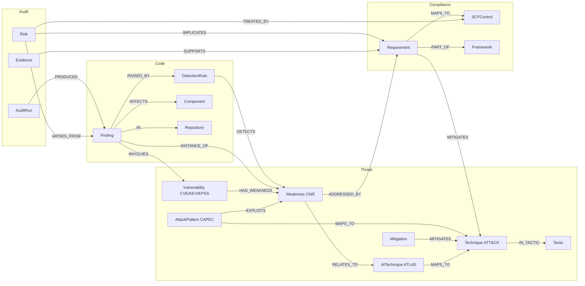

# Ontology v0.1.0

The graph has four layers joined by stable IDs. A finding in code climbs from the
code layer to the weakness layer, across to adversary behavior, and up to controls
in every framework SCF crosswalks.

## Nodes

| Label | Key | Source | Notes |
|---|---|---|---|
| `Framework` | `frameworkId` | seed | `licenseTier`, `textRedistributable` |
| `Requirement` | `reqId` = `<frameworkId>:<nativeId>` | NIST OSCAL, SCF | `text` only when `textLicensed=true` |
| `SCFControl` | `scfId` | SCF | crosswalk hub |
| `Weakness` | `cweId` (`CWE-89`) | CWE | `CHILD_OF` = Research view 1000 |
| `AttackPattern` | `capecId` | CAPEC | bridge weakness → technique |
| `Technique` / `Tactic` / `Mitigation` | `attackId` | ATT&CK STIX | revoked/deprecated excluded |
| `AITechnique` / `AITactic` / `AIMitigation` | `atlasId` | ATLAS | LLM and agent threats |
| `Vulnerability` | `cveId` | KEV, EPSS, scans | `kev`, `epss`, `epssPercentile` |
| `DetectionRule` | `ruleId` (`semgrep:<id>`) | rules/semgrep | must carry `metadata.cwe` |
| `SecureCodingTopic` | `topicId` | mappings/ | pre-coding guidance for agents |
| `Repository`, `Component` (`purl`) | | audit loop | |
| `AuditRun`, `Finding`, `Risk`, `Evidence` | | audit loop | history compounds across runs |
| `Source`, `OntologyVersion` | | loaders | provenance registry |

## Relationships

| Type | From → To | Authority | Key properties |
|---|---|---|---|
| `PART_OF` | Requirement/SCFControl → Framework | source | |
| `ENHANCES` | Requirement → Requirement | NIST | control enhancement → base |
| `MAPS_TO` | Requirement → SCFControl | SCF | `method`, `strm`, `confidence` |
| `MITIGATES` | Requirement → Technique | CTID | `rationale`, `confidence` |
| `MITIGATES` | Mitigation → Technique, AIMitigation → AITechnique | MITRE | |
| `ADDRESSED_BY` | Weakness → Requirement | **curated** | `confidence`, `reviewed`, `flaggedForReview` |
| `RELATES_TO` | Weakness → AITechnique | **curated** | `reviewed` |
| `EXPLOITS` | AttackPattern → Weakness | CAPEC | |
| `MAPS_TO` | AttackPattern/AITechnique → Technique | CAPEC / ATLAS | |
| `CHILD_OF` | Weakness → Weakness | CWE | `primary` |
| `SUBTECHNIQUE_OF`, `IN_TACTIC` | | ATT&CK / ATLAS | |
| `HAS_WEAKNESS` | Vulnerability → Weakness | KEV | |
| `DETECTS` | DetectionRule → Weakness | curated | |
| `CONCERNS` | SecureCodingTopic → Weakness | curated | |
| `SCANNED`, `PRODUCED`, `IN`, `AFFECTS`, `DEPENDS_ON`, `INVOLVES`, `RAISED_BY`, `INSTANCE_OF` | audit | loop | |
| `ARISES_FROM`, `IMPLICATES`, `TREATED_BY`, `SUPPORTS`, `PRODUCED_BY` | audit | loop | |

## Provenance rules

1. Every reference node carries `sourceId` (a `Source.sourceId`), `ingestedAt`, `isActive`.
2. Every edge carries `sourceId`. Curated edges also carry `confidence`, `reviewed`, `authority`.
3. Loaders `MERGE`, never `CREATE`, so re-ingest is idempotent.
4. Upstream removals flip `isActive=false` rather than deleting, so history survives.
5. `cgraph verify` fails if reference nodes lack provenance.

## License tiers

- **Tier 1** redistributable. Text included in the published dump.
- **Tier 2** fast-moving feeds, refreshed with `make refresh`.
- **Tier 3** licensed text (ISO, AICPA, PCI, CIS). Native IDs only, via SCF crosswalk. A BYOL importer may add text locally; it must never enter a published dump.

## Versioning

`OntologyVersion.version` follows semver. Adding labels/edges is minor. Renaming or
changing keys is major and needs a migration in `ontology/migrations/`.
Community Edition has no existence or type constraints, so required properties are
enforced in loaders and checked by `cgraph verify`.
